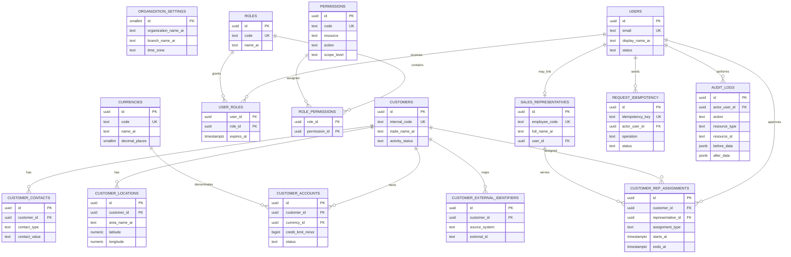

# مخطط العلاقات ERD — الإصدار التأسيسي

**الحالة:** مسودة قابلة للتطوير  
**النطاق:** فرع عدن فقط

## قيود حاكمة

- لا يوجد `branch_id` أو `tenant_id`.
- لكل عميل حساب واحد فقط لكل عملة.
- لكل عميل تكليف أساسي مفتوح واحد فقط.
- المعرف الخارجي فريد داخل نظام المصدر.
- سجل التدقيق لا يعتمد عليه لتخزين الحالة الحالية؛ هو أثر زمني غير قابل للتعديل من الواجهة.
- مخطط دفتر الحركات سيضاف في ترحيل وERD مستقل بعد تثبيت حالات الفاتورة والتحصيل والترحيل.
