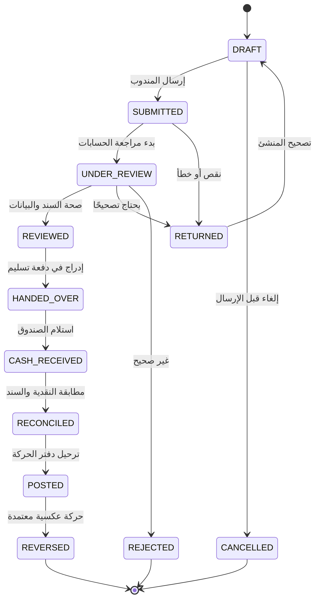
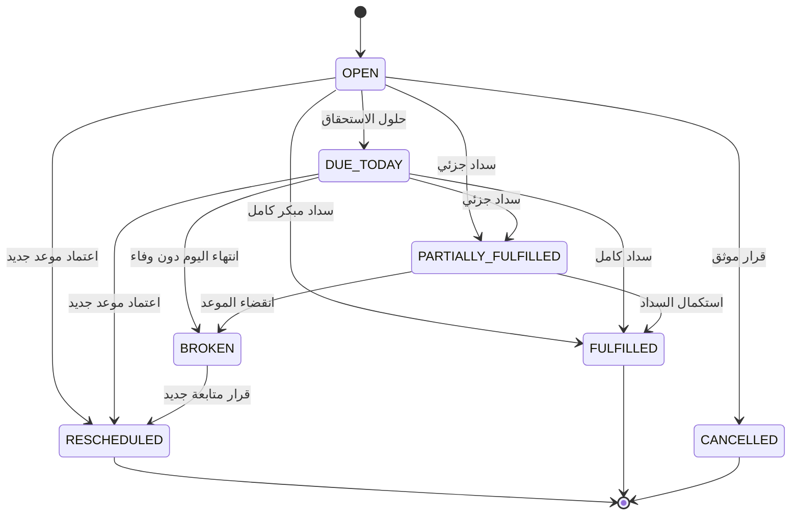
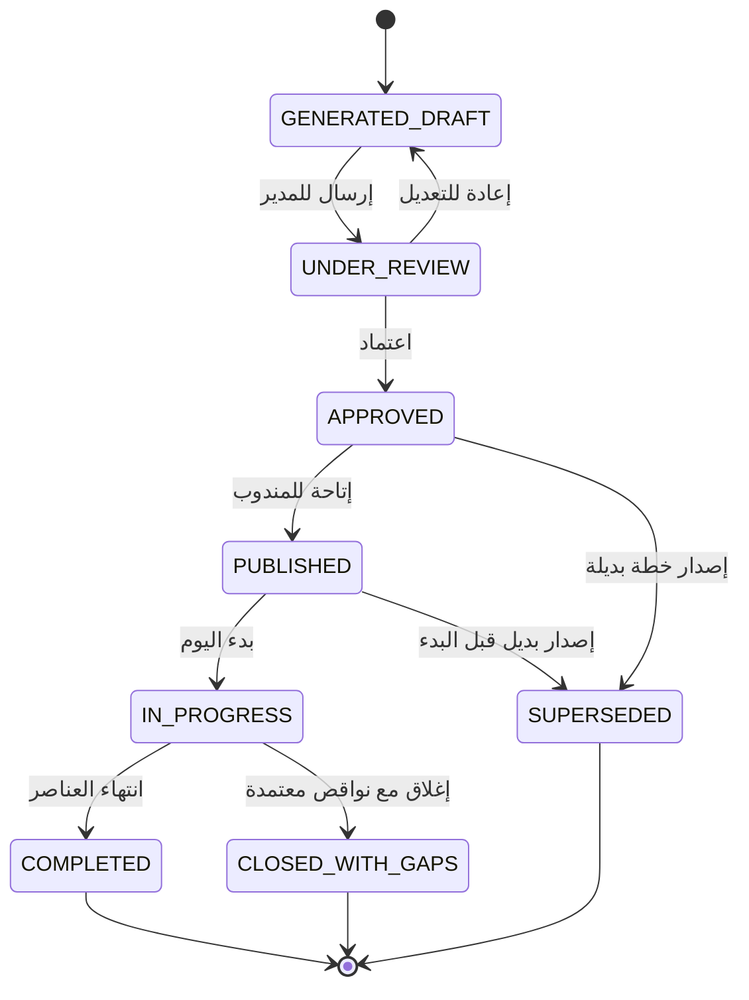
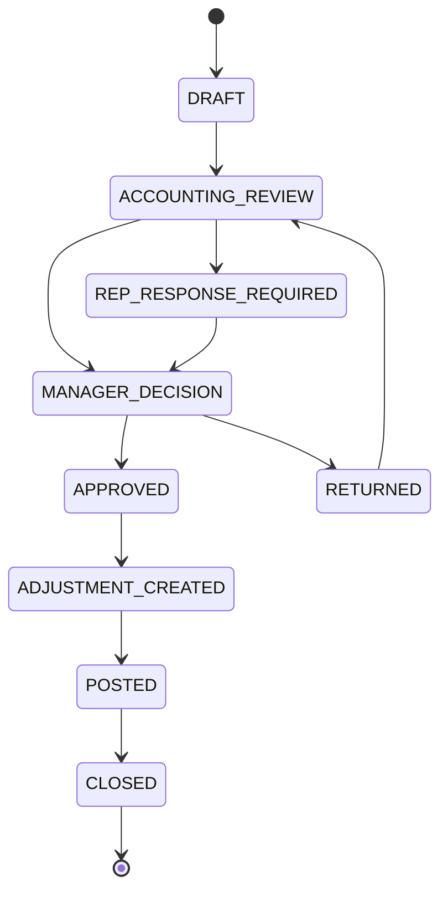
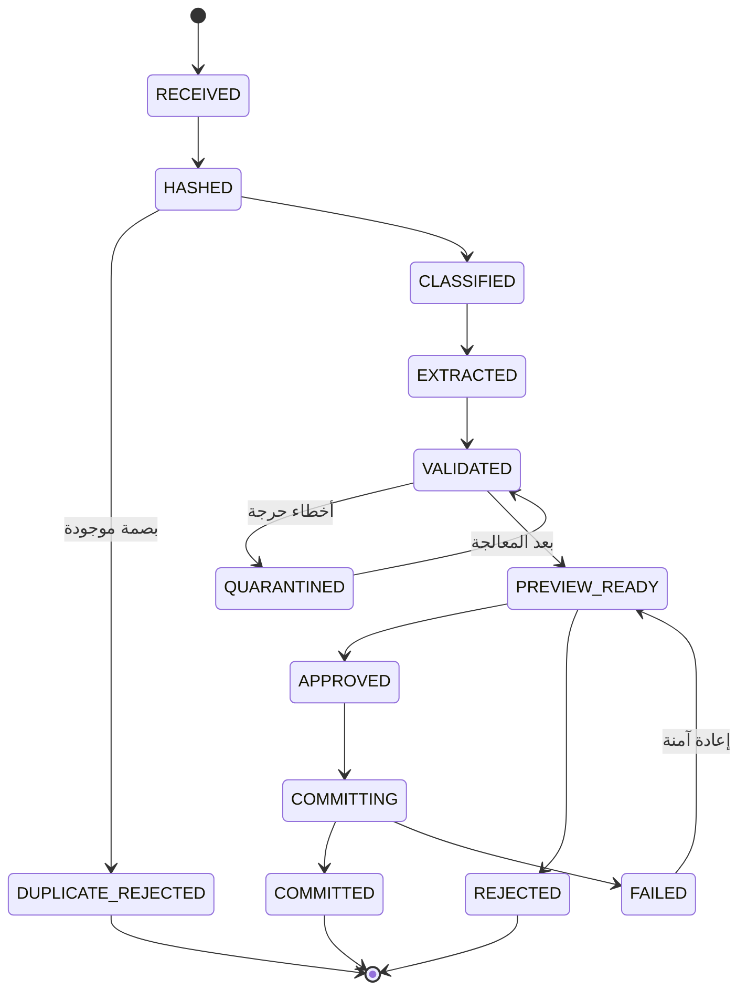
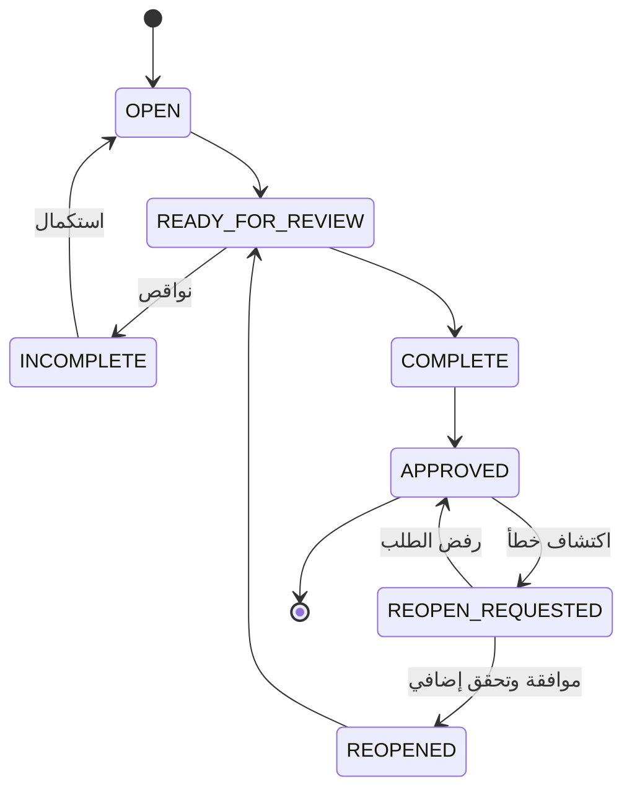

# مخططات حالات العمليات

**الحالة:** مسودة تنفيذية أولى

## 1. قواعد عامة

- كل انتقال حالة ينفذ عبر أمر صريح في طبقة الأعمال.
- لا تعدل الحالة مباشرة من الواجهة أو SQL التشغيلي.
- كل انتقال يسجل المستخدم والسبب والوقت ونتيجة التحقق.
- الانتقال غير المسموح يرفض حتى لو كان المستخدم يملك صلاحية عامة.
- العمليات المالية المعتمدة لا تعاد إلى مسودة؛ تستخدم حركة عكسية أو مسار تصحيح.

---

## 2. التحصيل

### أقفال المراحل

- بعد `SUBMITTED`: لا يغير المندوب المبلغ أو العملة مباشرة.
- بعد `REVIEWED`: لا يستبدل الإثبات.
- بعد `CASH_RECEIVED`: لا يخرج التحصيل من دفعة التسليم دون قرار موثق.
- بعد `POSTED`: التصحيح بالعكس فقط.

---

## 3. وعد السداد

إعادة الجدولة تنشئ وعدًا جديدًا مرتبطًا بالقديم، ولا تمحو حالة الوعد السابق.

---

## 4. خطة المندوب

كل إصدار يحتفظ بوقت قطع البيانات وإصدار قواعد التخطيط.

---

## 5. المطابقة

لا يؤثر الفرق في الرصيد قبل `POSTED`.

---

## 6. دفعة الاستيراد

---

## 7. الإغلاق اليومي

إعادة الإغلاق تنشئ إصدارًا جديدًا وتحفظ التقرير السابق.

---

## 8. معايير القبول العامة

- يرفض كل انتقال غير معرف.
- يرفض اعتماد المنشئ لحركته الحساسة.
- لا يمكن تجاوز مرحلة مطلوبة باستدعاء API مباشر.
- يسجل سبب الإرجاع والرفض والعكس وإعادة الفتح.
- تحفظ الحالات السابقة في سجل أحداث مستقل.
